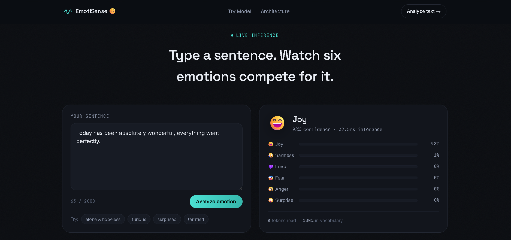

<div align="center">

# ***EmotiSense 😊***

#### ***🧠 Bidirectional GRU Neural Network for Real-Time Emotion Detection***

***Text → Emotion • Bi-GRU Architecture • PyTorch • Flask • Live Inference***

<p align="center">

</p>

<p align="center">


</p>

<p align="center">

<a href="https://emotisense-ki3d.onrender.com" target="_blank">

</a>

</p>

</div>

---

### ***🌟 About EmotiSense***

- *****EmotiSense** is a from-scratch **Bidirectional GRU** neural network, built with **PyTorch** and served through a **Flask** web app, that detects the emotion hidden inside a sentence.***

- ***Instead of a single left-to-right pass, EmotiSense reads every sentence in both directions at once  forward and backward  so context from the entire sentence shapes the final prediction, not just the words that came before.***

- The model intelligently performs tasks such as:
   - Real-time emotion inference from raw text
   - Six-way emotion classification (Sadness, Joy, Love, Anger, Fear, Surprise)
   - Confidence scoring across all emotion classes
   - Token-level vocabulary coverage reporting
   - Sub-50ms inference latency

---

### ***Live Demo***

> 🌐 ***Web Application: [EmotiSense](https://emotisense-ki3d.onrender.com)***

---

### ***📸 Project Preview***
<p align="center">

</p>

---

### ***Features ✨***

### 🧠 Bidirectional GRU Engine
- Two stacked BiGRU layers (128 → 64 units)
- Reads text forward & backward simultaneously
- Dropout(0.5) regularization after every GRU stage
- Trained from scratch — no pretrained transformer

### 😊 Six-Way Emotion Classification
- Sadness · Joy · Love · Anger · Fear · Surprise
- Softmax confidence distribution across all classes
- Instant top-emotion prediction with emoji feedback

### ⚡ Live Inference Demo
- Real-time text-to-emotion analysis
- Confidence bar chart per emotion
- Token count & vocabulary coverage stats
- Example chips for one-click testing

### 🛠 Clean, Deployable Backend
- Flask-served REST inference endpoint
- Dockerized for one-command deployment
- Lightweight 10k-token vocabulary + 300-d embeddings

---

### ***📂 Folder Structure***

```text
emotisense/
│
├── __pycache__/            # Compiled Python cache
├── model/                  # Trained BiGRU model weights & architecture
├── notebook/                # Training / experimentation notebooks
├── preview/
│   └── emotisense.png       # Project preview screenshot
├── static/                  # CSS, JS, and frontend assets
├── templates/                # Flask HTML templates (index.html etc.)
├── venv/                     # Virtual environment (local, not versioned)
│
├── .dockerignore
├── .gitignore
├── app.py                    # Flask app entry point / inference server
├── docker-compose.yml        # Multi-container orchestration
├── Dockerfile                 # Container build instructions
└── requirements.txt           # Python dependencies
```

---

### ***🧠 Model Architecture***

```text
                     Input Sentence
                          │
                          ▼
                Tokenize + Pad Sequence
                          │
                          ▼
              Embedding Layer (10,000 × 300)
                          │
                          ▼
              BiGRU Layer 1 (128 units)
              forward ──────────────► 
              backward ◄──────────────
                          │
                          ▼
              BiGRU Layer 2 (64 units)
              forward ──────────────►
              backward ◄──────────────
                          │
                          ▼
                Dense Layer (Softmax, 6)
                          │
                          ▼
        Sadness · Joy · Love · Anger · Fear · Surprise
                          │
                          ▼
                  Final Emotion Prediction
```

---

### ***🛠 Tech Stack***
- ***Deep Learning: PyTorch | NumPy***
- ***Model: Bidirectional GRU (Stacked, 128 → 64 units)***
- ***Dataset: dair-ai/emotion (~20k labeled sentences)***
- ***Backend: Python 3.11 | Flask***
- ***Frontend: HTML | CSS | JavaScript (Canvas-based live visualizations)***
- ***Deployment: Render & Docker***

---

### ***📊 Model Specs***
- ***Vocabulary Size:*** 10,000 tokens
- ***Embedding Dimension:*** 300-d
- ***Hidden Units:*** 128 → 64 (bidirectional, stacked)
- ***Output Classes:*** 6 emotions
- ***Regularization:*** Dropout(0.5) after each GRU stage
- ***Avg. Inference Latency:*** ~30–40ms per sentence

---

### ***🎯 Use Cases***

✔ Sentiment & Emotion Analysis Tool

✔ Customer Feedback Emotion Tagging

✔ Chatbot Emotional Context Layer

✔ Social Media Mood Tracking

✔ Mental Health Journaling Aid

✔ NLP Learning / Research Reference

---

### ***🔮 Future Enhancements***

- Multi-language emotion detection
- Attention layer on top of BiGRU for better interpretability
- Emotion trend tracking over multiple messages
- REST API with authentication for external integration
- Model quantization for faster edge inference
- Fine-tuning on domain-specific corpora (reviews, chats, support tickets)

---

### 👨‍💻 Developer

<div align="center">

## ***ANKIT GUPTA 👦***

***AI Engineer • Deep Learning Developer • NLP & GenAI Enthusiast***

***Building intelligent AI systems from scratch***

</div>

---

### ***⭐ Support***

- If this project helped you,

- please consider giving it a ⭐ on GitHub.

- It motivates me to continue building high-quality open-source AI projects.

---

<div align="center">

### ***EmotiSense 😊***

***Read Both Ways. Understand the Feeling. Powered by Bidirectional GRU***

***Made with ❤️ by **Ankit Gupta*****

</div>
